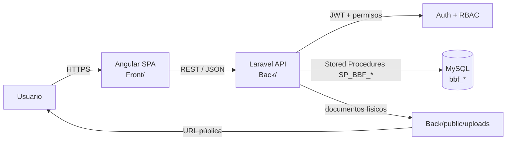

# Arquitectura BBF SisAdmin – Barro Blanco Farms

## 1. Resumen ejecutivo

El proyecto BBF SisAdmin es un sistema Brownfield, ya implementado y parcialmente operativo, estructurado como una SPA Angular en frontend y un backend Laravel monolítico modular con una fuerte dependencia de MySQL y procedimientos almacenados `SP_BBF_*`. La evidencia del código confirma que la persistencia principal no se resuelve con Eloquent directo ni con consultas SQL ad hoc; la capa de acceso a datos está centralizada en repositorios que invocan procedimientos almacenados. La API expone un conjunto de rutas protegidas por JWT y validación de permisos, y la capa de UI aplica controles de UX para ocultar menús y rutas según permisos, aunque la validación real y autorizativa se realiza en Laravel.

La documentación del repositorio no contiene un artefacto de arquitectura definitivo previo que haya quedado finalizado. El trabajo anterior quedó interrumpido antes de cerrar el entregable. Este documento vuelve a retomar el contexto real del proyecto, valida lo que existe en el código y deja explícitas las diferencias entre AS-IS y TO-BE.

## 2. Contexto del proyecto y estado Brownfield

- Proyecto existente y parcialmente implementado.
- Frontend: Angular 22.
- Backend: Laravel 12.
- PHP: 8.2.
- Base de datos: MySQL.
- API: REST JSON.
- Autenticación: JWT con refresh token.
- Autorización: usuarios, roles, permisos.
- Persistencia: procedimientos almacenados `SP_BBF_*` y tablas `bbf_*`.
- Documentación física: archivos bajo `Back/public/uploads` y URL pública establecida por `APP_URL` / `backendUrl`.

El repositorio no muestra una arquitectura Greenfield; la funcionalidad ya está construida y es operativa en varias áreas (empleados, aspirantes, contratación, dotaciones, herramientas, capacitaciones, retiros, novedades, notificaciones).

## 3. Recuperación del contexto BMAD existente

### Hallazgo principal
No se encontró en el repositorio un artefacto de arquitectura final o de planeación del proyecto que estuviera ya concluido. La carpeta `_bmad` contiene la infraestructura del framework BMAD, no el documento del proyecto ni una arquitectura final del sistema BBF.

### Evidencia observada
- `_bmad/`: motor BMAD, configuración e infraestructura general.
- `.agents/skills/...`: plantillas de skills, no artefactos de proyecto.
- `_bmad-output/`: directorio vacío.
- `Back/README.md`: documentación técnica del backend, relevante pero no sustituye al artefacto arquitectónico del proyecto.
- `README.md` raíz: apenas un resumen del proyecto y no define arquitectura.

### Conclusión de la interrupción
El trabajo anterior no llegó a producir un `architecture.md` ni ninguna derivación de BMAD del proyecto. Este documento se genera como continuación de la línea de trabajo, validando el estado real del repositorio sin sobreescribir artefactos inexistentes.

## 4. Arquitectura AS-IS real del repositorio

### 4.1 Frontend: Angular

#### Versión real
`Front/package.json` confirma Angular 22:
- `@angular/core`: `^22.0.0`
- `@angular/cli`: `^22.0.3`
- `@angular/build`: `^22.0.3`

#### Estructura funcional real
La app usa una organización por features y core, con los siguientes grupos principales:

- `src/app/core`: guardas, servicios, interceptores, modelos, configuraciones de autenticación.
- `src/app/features`: módulos funcionales del dominio.
- `src/app/shared`: componentes compartidos.
- `src/app/layout`: estructura visual de la aplicación.
- `src/app/contracts`: subárea funcional para contratos.

No existe una carpeta `core/shared/features` estricta como convención fija; la estructura real es más bien una combinación de `core`, `features`, `shared`, `layout` y subcarpetas funcionales.

#### Enrutamiento y permisos
- `Front/src/app/app.routes.ts` define rutas bajo `/admin` protegidas por `authGuard`, `permissionGuard`, `passwordChangeGuard`.
- Los permisos se configuran como data de ruta: `data: { permissions: ['ASPIRANTES_VER'] }` y similares.
- Se usa navegación lazy-loading por componentes.

#### Autenticación y autorización frontend
- `AuthService` guarda tokens en `localStorage` (`access_token`, `refresh_token`, `auth_user`, roles y permisos).
- `auth.guard.ts` valida si existe sesión o si el usuario tiene permisos requeridos.
- `passwordChangeGuard` obliga a cambiar contraseña si el backend indica `requiere_cambio_password`.
- `authInterceptor` inyecta el token y reintenta la solicitud si el servidor responde `401`, usando refresh token.

#### Seguridad de UX vs Seguridad real
- Seguridad de UX: ocultar rutas, botones y menús según permisos en Angular.
- Seguridad real: validación de `auth.jwt` y `permission` en Laravel.
- El frontend no puede ser la única línea de defensa; el backend aplica permisos en cada ruta con middleware `permission:...`.

#### Configuración de entorno
- `Front/src/environments/environment.ts`: local.
- `Front/src/environments/environment.prod.ts`: producción.
- `Front/angular.json`: la build de producción reemplaza `environment.ts` por `environment.prod.ts`.
- `Front/src/index.html`: usa `<base href="/">`.

#### Evidencia de riesgo de ambientes
La documentación y los entornos muestran inconsistencias de ruta y comportamiento:
- `Front/README.md` menciona `http://localhost/BBF%20SisAdmin/Back/public/api` como local.
- `Front/src/environments/environment.ts` apunta a `http://127.0.0.1:8000/api`.
- `Front/src/environments/environment.prod.ts` apunta a `https://barroblancofarms.com.co/SA/Back/public/index.php/api`.
- `Back/.env` apunta a `https://barroblancofarms.com.co/Back/public` con `APP_URL` y `CORS_ALLOWED_ORIGINS` distintos.

Esto confirma un riesgo real de mezcla entre URLs por entorno y una posible conservación de apuntamientos de otro ambiente si no se revisa el build y la configuración.

### 4.2 Backend Laravel

#### Versión real
`Back/composer.json` confirma:
- Laravel `^12.0`
- PHP `^8.2`
- dependency `dedoc/scramble` para OpenAPI

#### Estructura real
La app Laravel sigue una organización monolítica modular:

- `app/Http/Controllers/Api`: controllers por dominio.
- `app/Services`: lógica de negocio por módulo.
- `app/Repositories`: acceso a persistencia y llamadas a procedimientos almacenados.
- `app/Http/Middleware`: `JwtAuthenticate` y `EnsurePermission`.
- `app/Http/Requests`: validación de entrada.
- `app/Exceptions`: manejo de errores.
- `app/Console/Commands`: bootstrap y tareas de mantenimiento.

#### API REST y rutas
`Back/routes/api.php` define rutas protegidas por `auth.jwt` + middleware `permission:...` por dominio:
- autenticación
- usuarios
- roles y permisos
- empleados
- aspirantes
- contratación
- dotación
- herramientas
- retornos
- capacitaciones
- novedades
- retiros
- notificaciones
- parámetros

#### Autenticación y JWT
La autenticación se implementa con una capa propia sobre JWT firmada con HMAC-SHA256:
- `config/jwt.php`
- `app/Services/JwtService.php`
- `app/Http/Middleware/JwtAuthenticate.php`
- `app/Http/Middleware/EnsurePermission.php`

El JWT codifica claims como:
- `id_usuario`
- `id_sesion`
- `correo`
- `nombre_usuario`
- `tipo_usuario`
- `roles`
- `permisos`

El refresh token se maneja en sesiones del usuario y se rota en cada renovación.

#### Almacenamiento del token
La capa frontend almacena el token y el refresh token en `localStorage`.
En backend el refresh token se almacena con hash SHA-256 en la base de datos y se revoca al ser usado.

#### Capa de negocio
La lógica de negocio reside principalmente en:
- `controllers`: coordinar la request y serializar respuesta
- `services`: validaciones, cálculos, flujo de documentos, auditoría
- `repositories`: invocar procedimientos almacenados y estructurar los resultados
- `stored procedures`: persistencia y reglas principales de negocio

Este es un patrón híbrido claramente monolítico modular, no un sistema distribuido.

## 5. Persistencia y Stored Procedures

### 5.1 Patrón real
La base de datos se accede mediante procedimientos almacenados, y la validación en PHP se asegura de que solo se permitan nombres `SP_BBF_...`.

Evidencia clave:
- `Back/app/Repositories/StoredProcedureRepository.php`
- `Back/app/Repositories/AuthRepository.php`
- `Back/app/Repositories/UserRepository.php`
- `Back/app/Repositories/EmployeeRepository.php`

El repositorio base usa:

```php
DB::select("CALL {$procedure}({$placeholders})", $parameters);
```

y valida el nombre del procedimiento con una expresión regular.

### 5.2 Principales módulos con SP
Basado en el código y las rutas del API, los módulos con fuerte dependencia de procedimientos almacenados son:

- Autenticación: login, logout, refresh, sesiones
- Usuarios: listar, crear, cambiar estado, asignar roles
- Roles y permisos: CRUD + asociaciones
- Empleados: listar, crear, buscar por documento, actualizar, cambiar estado
- Aspirantes: listar, documentos, estado, conversión a empleado
- Contratación: fichas, contratos, plantillas, firmas
- Dotaciones: tipos, tallas, entregas, evidencias, historial
- Herramientas: inventario y entregas
- Capacitación: tareas, sesiones, evaluaciones, confirmaciones, compromisos
- Novedades: tipos, vacaciones, permisos, incapacidades, soportes
- Retiro: motivos, documentos, entrevista, finalización
- Notificaciones: sincronización y lectura

### 5.3 Acoplamiento Laravel ↔ Stored Procedures
Riesgos arquitectónicos reales:
- acoplamiento fuerte a los SP del esquema MySQL
- cambios en procedimientos requieren coordinación con backend y base de datos
- pruebas unitarias y repositorios asumen contratos SQL muy específicos
- menor portabilidad del backend; el negocio está parcialmente en la BD
- mayor complejidad para trazabilidad y auditoría si los SP no están documentados

No se recomienda reemplazar SP por Eloquent de forma automática; la decisión actual es mantenerlos y evolucionarlos de manera controlada.

### 5.4 Estado de la versión de procedimientos
El repositorio incluye un archivo de ejemplo y la BD apunta a procedimientos MySQL reales, pero no hay un conjunto completo de definiciones de SP versionadas dentro de `Back/database/procedures/`.

Esto implica una dependencia importante de un esquema ya existente fuera del repositorio, con documentación funcional incompleta en código.

## 6. Gestión documental

### 6.1 Dónde se almacenan los documentos actualmente
La evidencia del código confirma que el almacenamiento documental se realiza principalmente bajo `Back/public/uploads`.

Ejemplos reales:
- `Back/app/Services/ApplicantService.php`
- `Back/app/Services/ContractingService.php`
- `Back/app/Services/EmployeeService.php`
- `Back/app/Services/DotationService.php`
- `Back/app/Services/ReturnService.php`
- `Back/app/Services/ToolService.php`
- `Back/app/Services/TrainingService.php`

Se observa almacenamiento por tipo de documento:
- `uploads/applicants/...`
- `uploads/contracts/...`
- `uploads/medical-exams/...`
- `uploads/employees/...`
- `uploads/dotations/...`
- `uploads/returns/...`
- `uploads/tool-deliveries/...`
- `uploads/trainings/...`

### 6.2 Patrón de almacenamiento
El patrón es:
- archivo físico cargado por Laravel `UploadedFile`
- guardado en `public_path(...)`
- se genera una ruta relativa tipo `uploads/applicants/5/documents/archivo.pdf`
- la ruta se persiste en la base de datos como `archivo_ruta`
- la URL pública se reconstruye con `url($ruta)` o `APP_URL`

### 6.3 Riesgos de despliegue y actualización
- los archivos están dentro de un directorio público (`public/uploads`) y son frágiles ante despliegues no coordinados
- si el despliegue reemplaza el contenido de `public`, pueden perderse archivos reales de usuarios
- la ruta está acoplada a la infraestructura del servidor y no siempre se protege con un almacenamiento externo
- se combina almacenamiento físico con rutas en BD y URL pública, sin una política clara de ciclo de vida

### 6.4 Diagnóstico AS-IS
La estrategia AS-IS es una combinación de:
- directorio físico bajo `Back/public/uploads`
- base de datos con referencias a rutas
- URLs públicas reconstruidas desde `APP_URL` y `public_path`
- ausencia de un mecanismo robusto de almacenamiento externo o cloud

## 7. Módulos funcionales reales

### Clasificación por módulo

| Módulo | Estado | Evidencia |
|---|---|---|
| Autenticación | IMPLEMENTADO | `AuthController`, `AuthService`, JWT, refresh, logout |
| Usuarios | IMPLEMENTADO | `UserController`, `UserRepository`, rutas `/users` |
| Roles | IMPLEMENTADO | `RoleController`, `RoleRepository` |
| Permisos | IMPLEMENTADO | `RoleController::permissions`, `EnsurePermission` |
| Empleados | IMPLEMENTADO | `EmployeeController`, `EmployeeService`, `EmployeeRepository` |
| Aspirantes | IMPLEMENTADO | `ApplicantController`, `ApplicantService` |
| Contratación | IMPLEMENTADO | `ContractingController`, `ContractingService` |
| Dotaciones | IMPLEMENTADO | `DotationController`, `DotationService` |
| Herramientas | IMPLEMENTADO | `ToolController`, `ToolService` |
| Devoluciones | IMPLEMENTADO | `ReturnController`, `ReturnService` |
| Capacitación | IMPLEMENTADO | `TrainingController`, `TrainingService` |
| Incapacidades | PARCIAL | manejado bajo `novelties` con tracking de discapacidad |
| Permisos / licencias | PARCIAL | forman parte de novedades y autorización, no módulo standalone |
| Llamados de atención | NO ENCONTRADO | no hay controller, ruta ni servicio dedicado |
| Suspensiones | NO ENCONTRADO | no hay módulo ni rutas claras |
| Solicitudes internas | NO ENCONTRADO | no hay evidencia de módulo dedicado |
| Notificaciones | IMPLEMENTADO | `NotificationController`, `NotificationRepository` |
| Retiro o finalización laboral | IMPLEMENTADO | `RetirementController`, `RetirementService` |

## 8. Dominio principal y flujo funcional

### 8.1 Flujo Aspirante → Contratación → Empleado
La forma más clara indicada por el código es:

```text
Aspirante
  ↓
Contratación / aprobación
  ↓
Empleado
```

La entidad `Applicant` puede convertirse a `Employee` mediante `convertToEmployee` en el backend y el frontend cuenta con la ruta correspondiente.

### 8.2 Flujo Empleado → RRHH operativo
El sistema demuestra que `Empleado` funciona como centro funcional del dominio, con dependencias hacia:

- Dotación
- Herramientas
- Devoluciones
- Capacitación
- Contratación
- Documentos
- Novedades / retiros / notificaciones

Esto permite considerar que `Empleado` es la entidad funcional central del dominio, aunque la lógica del negocio se distribuya entre varios módulos y procedimientos.

## 9. Seguridad real

### 9.1 Cadena de seguridad
La arquitectura verifica la siguiente secuencia:

```text
Usuario -> Rol -> Permisos
```

Evidencia real:
- `AuthService` obtiene roles y permisos después del login.
- `UserRepository` expone `roles()` y `permissions()` usando SP.
- `EnsurePermission` valida permisos en el middleware Laravel.
- `permissionGuard` en Angular valida permisos a nivel UX.

### 9.2 Login, refresh y logout
- Login: `POST /api/auth/login`
- Refresh: `POST /api/auth/refresh`
- Logout: `POST /api/auth/logout`
- Me: `GET /api/auth/me`
- Change password: `POST /api/auth/change-password`

La sesión de refresh se rota y se revoca si se usa nuevamente.

### 9.3 JWT
- `JwtService` firma tokens con algoritmo HS256.
- `config/jwt.php` define TTL y secret.
- `JwtAuthenticate` valida token y expira.
- `exp`, `nbf`, `iat`, `iss` están presentes.

### 9.4 CORS
- `Back/config/cors.php` define `CORS_ALLOWED_ORIGINS` desde `.env`.
- Los orígenes son explícitos y no se acepta `*`.

### 9.5 Distinción de seguridad
- Seguridad de UX: rutas y botones ocultos.
- Seguridad real: validación del backend basada en `auth.jwt` y `permission`.

No existe evidencia de que el frontend haga validaciones exclusivas sin repetir validación real en backend.

## 10. Ambientes y despliegue

### 10.1 Configuración actual por ambiente
- Local: `Front/src/environments/environment.ts` + Laravel `.env` local.
- Producción: `Front/src/environments/environment.prod.ts` + `Back/.env` producción.

### 10.2 Riesgos observados
- Diferentes rutas de API para local vs producción.
- diferentes URLs de backend para `APP_URL` y `Front`.
- `Back/.env` usa `APP_URL=https://barroblancofarms.com.co/Back/public`, pero Front prod usa `https://barroblancofarms.com.co/SA/Back/public/index.php/api`.
- `Front/src/index.html` usa `<base href="/">`, lo que puede combinarse con rutas relativas poco predecibles si el despliegue no está bien estructurado.

### 10.3 Despliegue real observado
La estructura indicada por el código y la configuración sugiere:

```text
/SA/
  Frontend Angular
  Back/
    public/
      index.php
```

Pero el repositorio no asegura que esta ruta sea exactamente la misma en todos los ambientes. El riesgo real está en la configuración contractual entre frontend, backend y rutas públicas.

## 11. Arquitectura de alto nivel



## 12. Clasificación arquitectónica

La aplicación puede describirse como:

- Frontend SPA desacoplado en Angular
- Backend monolítico modular en Laravel
- Persistencia en base de datos relacional MySQL
- Alta dependencia de Stored Procedures
- No hay evidencia de microservicios ni de arquitectura distribuida

El término “microservicios” no aplica al estado actual del repositorio.

## 13. ADRs (Architecture Decision Records)

### ADR-001 — Mantener Angular + Laravel
- Contexto: frontend y backend ya están diferenciados y conectados por API REST.
- Decisión: seguir con Angular en frontend y Laravel en backend.
- Razones: madurez, velocidad de entrega, separación lógica, experiencia del equipo.
- Consecuencias: dos proyectos, despliegue y configuración separados, mayor necesidad de coordinación de versiones.
- Estado: aceptado.

### ADR-002 — Mantener MySQL como base de datos principal
- Contexto: la aplicación usa vistas, tablas `bbf_*`, stored procedures y consultas de negocio sobre esquema relacional.
- Decisión: conservar MySQL.
- Razones: base consolidada, stored procedures ya implantados, lógica de negocio en BD.
- Consecuencias: acoplamiento a DB y SP; requiere documentación y versionado de cambios.
- Estado: aceptado.

### ADR-003 — Mantener Stored Procedures y evolucionarlos controladamente
- Contexto: la lógica de negocio y la persistencia están ampliamente acopladas a `SP_BBF_*`.
- Decisión: no reemplazarlos automáticamente por Eloquent.
- Razones: el sistema ya depende de ellos y el equipo los usa como punto operativo de negocio.
- Consecuencias: documentar procedimientos, versionar cambios y verificar compatibilidad.
- Estado: aceptado / con riesgo.

### ADR-004 — Mantener backend monolítico modular
- Contexto: no hay evidencia de microservicios ni separación por dominios distribuibles.
- Decisión: seguir con monolito modular.
- Razones: un solo API, shared services y repositorios, dependencias CRUD de un mismo esquema.
- Consecuencias: crecimiento de complejidad orgánica y de módulos, pero sin necesidad de distribución.
- Estado: aceptado.

### ADR-005 — RBAC basado en usuarios, roles y permisos
- Contexto: la autorización real se resuelve via permisos, roles y usuarios en los SP y middleware.
- Decisión: mantener el modelo RBAC.
- Razones: rutas protegidas por `permission` y permisos del JWT.
- Consecuencias: más control y complejidad operativa, pero seguridad explícita y auditabilidad.
- Estado: aceptado.

### ADR-006 — Estrategia actual de almacenamiento documental
- Contexto: archivos físicos guardados en `public/uploads` con rutas en BD.
- Decisión: continuar con almacenamiento físico en directorio público para el estado actual.
- Razones: es la estrategia ya implementada por servicios de archivos y es compatible con URLs públicas.
- Consecuencias: riesgo durante despliegues y sensibilidad a reemplazos del directorio `public`.
- Estado: aceptado AS-IS, condicionado a mejora TO-BE.

### ADR-007 — Configuración independiente por ambientes
- Contexto: hay distintos entornos para local y producción con archivos de entorno separados.
- Decisión: mantener separación de configuraciones por ambiente.
- Razones: Angular usa `environment.ts` y `environment.prod.ts`, Laravel usa `.env` por entorno.
- Consecuencias: deben revisarse consistencias y no mezclar URL ni rutas entre ambientes.
- Estado: aceptado, pero con advertencias de riesgo.

## 14. Requisitos no funcionales

### Seguridad
- JWT con expiración y refresh rotation.
- ROLES + permisos en middleware.
- CORS explícito.
- Hash de credenciales y control de password change.
- Estado: parcialmente consolidado; falta auditoría global más formal.

### Mantenibilidad
- Código modular por dominios y servicios.
- Repositorios centralizados.
- Estado: buena organización funcional, pero depende de SP con documentación parcial.

### Escalabilidad
- El backend y la arquitectura actual son adecuados para crecimiento incremental.
- Estado: PENDIENTE DE DEFINICIÓN para métricas de carga y partición de módulos.

### Integridad de datos
- Good: el uso de SP y validaciones de request fortalece la consistencia.
- Riesgo: duplicación de reglas entre Laravel y MySQL.

### Trazabilidad
- Auditoría configurada para login, cambio de contraseña, creación/actualización de datos y operaciones clave.
- Estado: útil pero incompleta en algunos módulos y sin un esquema de trazabilidad transversal documentado.

### Gestion documental
- En AS-IS hay almacenamiento bajo `public/uploads` con rutas vía BD.
- Estado: PENDIENTE DE DEFINICIÓN para política de retención, backups, eliminación segura y storage externo.

### Observabilidad y logging
- Laravel logging `LOG_CHANNEL=stack`.
- SP y errores quedan en logs, pero no hay una estrategia central de observabilidad mejorada.
- Estado: PARCIAL.

### Configuración por ambientes
- Implementación base presente.
- Riesgo: rutas hardcodeadas y diferencias reales entre `.env`, `angular.json` y README.

### Manejo de errores
- API responde con formato estándar JSON y excepciones personalizadas.
- Estado: bien implementado en la mayoría de los controladores, con variaciones por dominio.

### Rendimiento
- Dependencia de SP y consultas bien acotadas.
- Estado: PENDIENTE DE DEFINICIÓN para métricas ni SLOs.

### Respaldo y recuperación
- No se observa una política formal declarada en repositorio.
- Estado: PENDIENTE DE DEFINICIÓN.

## 15. Riesgos técnicos

### 1. Dependencia crítica de Stored Procedures
- Nivel: Alto
- Motivo: si cambia la firma de un SP o el esquema de la BD, el backend puede romperse en múltiples módulos.

### 2. Duplicación de reglas entre Laravel y MySQL
- Nivel: Alto
- Motivo: el negocio está repartido entre PHP y procedimientos almacenados; puede existir lógica duplicada o inconsistente.

### 3. Crecimiento del módulo de Empleados
- Nivel: Medio
- Motivo: la entidad empleado centraliza muchos procesos y documentos; sin una estrategia de historial y dominio claro puede crecer sin control.

### 4. Archivos en directorio público sujetos a despliegue
- Nivel: Alto
- Motivo: los archivos se guardan bajo `public/uploads` y son vulnerables a reemplazos de despliegue.

### 5. URLs hardcodeadas y diferencias de ambiente
- Nivel: Alto
- Motivo: rutas distintas en `environment.ts`, `environment.prod.ts`, README, .env, BD legacy y scripts.

### 6. Autorización solo frontend en escenarios no defendidos
- Nivel: Medio
- Motivo: si el frontend se usa como único control, la app puede permitir accesos no autorizados; el backend evita este riesgo, pero la UX no debe ser la única capa.

### 7. Componentes altamente acoplados
- Nivel: Medio
- Motivo: múltiples features dependen de la misma base de datos y del mismo conjunto de permisos y rutas.

### 8. Falta de trazabilidad transversal
- Nivel: Medio
- Motivo: aunque existe auditoría, no siempre está sistematizada para todos los módulos y procesos.

### 9. Procedimientos almacenados sin documentación suficiente
- Nivel: Alto
- Motivo: el repositorio no mantiene un catálogo claro de SP documentados y sus firmas, lo que dificulta evolución segura.

## 16. Arquitectura objetivo (TO-BE)

La arquitectura objetivo no pretende reconstruir el sistema, sino evolucionarlo de forma incremental.

### Secuencia recomendada

```text
Arquitectura actual
      ↓
Formalizar módulos
      ↓
Centralizar configuración
      ↓
Documentar Stored Procedures
      ↓
Consolidar RBAC
      ↓
Proteger almacenamiento documental
      ↓
Mejorar trazabilidad
      ↓
Implementar módulos pendientes
      ↓
Construir historial laboral integral del empleado
```

### Recomendaciones principales
1. Formalizar el modelo de módulos y mantener estructura consistente entre `core/features/shared/layout`.
2. Centralizar todas las URLs y configuración de ambientes en un único proceso de build y release review.
3. Documentar catalogación de SP por dominio, con firma, responsable, inputs, outputs y riesgos.
4. Consolidar permisos de RBAC y mantener una matriz clara de permisos por módulo.
5. Mover almacenamiento documental fuera de `public/uploads` hacia un repositorio gestionado por storage con políticas de despliegue y retención.
6. Mejorar trazabilidad y observabilidad con IDs de request, usuario, módulo y correlación de eventos.
7. Continuar con evolución incremental sin reescrituras de negocio ni reemplazo abrupto de SP.
8. Completar el historial del empleado como una sola vista agregada de contratación, dotación, novedades, herramientas, capacitaciones y retiros.

## 17. Pendientes arquitectónicos

- Confirmar y documentar la matriz completa de procedimientos `SP_BBF_*` por dominio.
- Revisar si los permisos en frontend y backend están absolutamente alineados.
- Establecer política formal de almacenamiento documental fuera de `public`.
- Consolidar un proceso de release para ambientes y revisión de URLs hardcodeadas.
- Definir política de respaldo y recuperación de archivos y base de datos.
- Establecer trazabilidad global con request IDs y logs de negocio.
- Documentar módulos aún parciales o no encontrados.

## 18. Conclusiones

La arquitectura real del proyecto es una combinación de:

- Angular 22 como frontend SPA
- Laravel 12 como backend monolítico modular
- MySQL con procedimientos almacenados `SP_BBF_*`
- JWT para autenticación y refresh token
- RBAC por usuarios, roles y permisos
- almacenamiento físico documental bajo `public/uploads`
- separación funcional por dominio, pero con fuerte dependencia del esquema e infraestructura DB

El sistema es viable y está ampliamente implementado, pero su continuidad requiere control de cambios incrementales sobre los stored procedures, un tratamiento más seguro del almacenamiento documental y una política formal de configuración por ambientes para evitar regresiones en despliegue.

## 19. Documento BMAD final

Este artefacto se entrega como la arquitectura final del proyecto BBF SisAdmin, validada contra el código real del repositorio. Dado que no existía un documento previo finalizado, esta versión constituye el primer entregable arquitectónico completo y verificable del estado AS-IS actual, además de la propuesta TO-BE incremental para continuar evoluciando el sistema.
